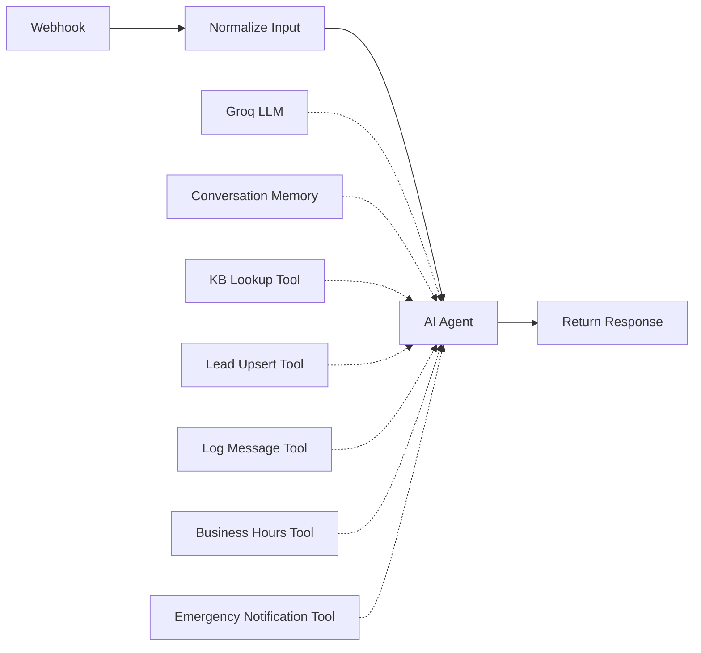
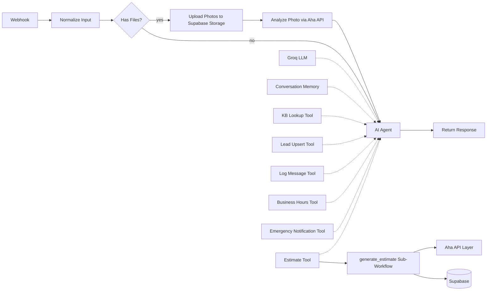

# Multi-Niche Chat Agent — Extended Architecture Specification

---

## 1. Workflow Overview

### Current Architecture (Preserved)



### Extended Architecture



**Key design decisions:**
- The main workflow gains one new AI tool: **Estimate Tool** (calls `generate_estimate` sub-workflow)
- Photo processing happens **before** the AI Agent, in the Normalize → Agent path — photo metadata and analysis results are injected into the agent's context
- The `generate_estimate` sub-workflow is a standalone n8n workflow callable via **Execute Sub-Workflow** trigger — reusable across niches
- The Aha API layer is a custom HTTP service (self-hosted or serverless) that handles niche-specific estimate logic, photo analysis, and service enrichment

---

## 2. Main Workflow Nodes

### Nodes to Add

| Node Name | Node Type | Purpose | Input | Output | Connects To |
|-----------|-----------|---------|-------|--------|-------------|
| **Photo Router** | `n8n-nodes-base.if` | Branch on `hasFiles` from Normalize Input | `$json.hasFiles` | Routes to Photo Upload or directly to Agent | After Normalize Input; true → Photo Upload, false → AI Agent |
| **Download Photo** | `n8n-nodes-base.httpRequest` | Download file from URL if chat sends a URL (not binary) | `files[].url` | Binary file data | → Upload to Supabase Storage |
| **Upload to Supabase Storage** | `n8n-nodes-base.httpRequest` | PUT file to Supabase Storage bucket | Binary file + session_id + filename | `{ publicUrl, storagePath }` | → Record Photo in DB |
| **Record Photo in DB** | `n8n-nodes-base.supabase` | Insert row into `estimate_photos` table | `session_id, storage_path, public_url, mime_type, size_bytes` | `{ id }` | → Analyze Photo |
| **Analyze Photo** | `n8n-nodes-base.httpRequest` | POST to Aha API `/analyze-photo` | `{ photo_url, niche, issue_type }` | `{ labels[], severity, description, confidence }` | → Update Photo + Merge Context |
| **Merge Photo Context** | `n8n-nodes-base.code` | Inject photo analysis into `chatInput` context for Agent | Photo analysis result + original chatInput | Augmented `chatInput` with photo context | → AI Agent |
| **Estimate Tool** | `@n8n/n8n-nodes-langchain.toolWorkflow` | AI tool that calls `generate_estimate` sub-workflow | `{ session_id, niche, issue_type, zip, ... }` | `{ estimate_range, disclaimer, next_action }` | AI Agent tool connection |

### Nodes to Modify

| Node Name | Change |
|-----------|--------|
| **Normalize Input** | Add `niche` field extraction. Normalize file objects to `url`, `mimeType`, `fileName`. Make sure `session_id` is passed down consistently. |
| **AI Agent Prompt** | Add estimate tool instructions, photo-handling instructions, niche-awareness for all supported verticals. See Section 9. |

### Nodes to Remove

None — all existing nodes are preserved.

---

## 3. Estimate Sub-Workflow Nodes

**Workflow name:** `generate_estimate`
**Trigger type:** `n8n-nodes-base.executeWorkflowTrigger`

### Node Overview

1.  **Validate Required Fields**: Ensure minimum required fields per niche.
2.  **Serviceability Check via Aha**: POST `/serviceability` to verify coverage area.
3.  **Context Enrichment via Aha**: POST `/enrich` to pull regional pricing, material costs, case complexities.
4.  **Estimate Generation via Aha**: POST `/estimate` to generate the normalized pricing or path response.
5.  **Next Best Action via Aha**: POST `/next-action` to determine the specific CTA.
6.  **Save `estimate_requests` Row**: Log the incoming request to Supabase.
7.  **Save `estimate_results` Row**: Log the generated output to Supabase.
8.  **Format Response**: Return formatted `estimate_range`, `confidence`, and `disclaimer` back to the Agent.

---

## 4. Photo Upload Flow

1. **Receiving**: Webhook accepts `files[]` (JPEG, PNG, WebP up to 10MB, max 3 per message).
2. **Validation**: Check mime types and sizes.
3. **Upload**: Push to Supabase `chat-uploads/{niche}/{session_id}/{timestamp}_{filename}`.
4. **Record**: Insert row into `estimate_photos`.
5. **Analyze**: Aha API `/analyze-photo` returns structured labels, severity, and description.
6. **Augment**: Analysis summary updates `estimate_photos` and is injected into the prompt for the Groq LLM.

---

## 5. Aha API Contract

> **Aha APIs** = custom estimate service layer for home/professional verticals. The API handles niche-specific pricing algorithms, computer vision via `/analyze-photo`, and context mapping.

### Base URL
`{{AHA_API_URL}}` (e.g., `https://aha.flynerd.tech/api/v1`) with `x-api-key`.

### Endpoints 
- **POST `/serviceability/check`**: Validates whether the user's ZIP/state and issue are within the provider's active footprint and checks after-hours routing. Prevents quoting out-of-zone leads.
- **POST `/photo/analyze`**: Identifies equipment (HVAC), detects damage (Roofing/Water), spots pests, or assesses vehicle damage severity (Personal Injury). 
- **POST `/context/enrich`**: Maps raw intents to internal business logic. E.g., estimates house size band from address, evaluates statute of limitations (PI Law), maps family intent to estate planning tiers.
- **POST `/estimate/generate`**: The core logic payload. Produces a fee band, service-cost range, or consultation recommendation, plus mandatory disclaimers.
- **POST `/next-best-action`**: Given the urgency and estimate result, dictates whether to dispatch an emergency tech, schedule a consultation, or trigger an urgent attorney callback.

---

## 6. End-User Journeys and Aha Value-Add by Niche

### HVAC

- **The Journey:** The user lands on the site, asks about no cooling, replacement pricing, or maintenance. The agent answers basic FAQs, triages repair vs maintenance vs replacement, and collects address/ZIP, equipment type, symptom, urgency, and photos of the indoor/outdoor unit or model plate. If the user wants an estimate, the sub-workflow returns either a service-call range, likely repair band, or replacement-consultation range.
- **Aha APIs for HVAC:**
  - `serviceability/check`: confirms service zone and after-hours routing
  - `photo/analyze`: identifies condenser/furnace/air handler, visible corrosion, ice, dirty coil, model plate cues
  - `context/enrich`: estimates equipment class, home-size band, climate/service complexity
  - `estimate/generate`: produces diagnostic visit range, repair band, or replacement consultation band
  - `next-best-action`: decides between dispatch now, book service call, or book replacement consultation
- **Estimate / Value Add:** The value is not a final HVAC quote. It is a fast, structured “what this likely is + what the next step costs + what to schedule now” result. That reduces abandoned chats and speeds dispatch.

### Roofing

- **The Journey:** The user asks about a leak, storm damage, repair cost, or replacement. The agent collects address, roof issue, leak status, storm context, and photos. The estimate flow can return a preliminary tarp range, repair band, or replacement inspection recommendation.
- **Aha APIs for Roofing:**
  - `serviceability/check`: validates service area
  - `photo/analyze`: detects shingle damage, missing shingles, flashing issues, visible penetrations, tarp needs
  - `context/enrich`: estimates roof size/complexity band from address/property context
  - `estimate/generate`: returns emergency tarp band, minor repair band, leak investigation band, or replacement-inspection path
  - `next-best-action`: suggests inspection booking, urgent leak dispatch, or more-photo request
- **Estimate / Value Add:** The value is immediate triage and a fast pre-inspection price band, which is especially useful after storms when call volume spikes.

### Water Damage Restoration

- **The Journey:** The user reports flooding, a burst pipe, or wet walls/ceilings. The agent captures whether water is active, when discovered, affected rooms, property type, and photos. The flow should return an emergency severity level, probable mitigation scope, and dispatch priority.
- **Aha APIs for Water Damage:**
  - `serviceability/check`: validates emergency coverage zone
  - `photo/analyze`: identifies standing water, ceiling saturation, wall staining, flooring impact, visible content damage
  - `context/enrich`: estimates affected-area band and urgency severity
  - `estimate/generate`: returns emergency-response band, drying/mitigation scope band, or inspection recommendation
  - `next-best-action`: dispatch immediately, same-day callback, or schedule inspection
- **Estimate / Value Add:** The value is speed. It turns a panicked “help” message into a structured emergency intake with realistic next steps and a mitigation range, without pretending to replace an on-site assessment.

### Plumbing

- **The Journey:** The user asks about a leak, clog, water heater, sewer backup, or larger job. The agent collects issue type, severity, address/ZIP, fixture/system, and photos. The estimate flow returns a service-call band, common repair band, or install/replacement consultation band.
- **Aha APIs for Plumbing:**
  - `serviceability/check`: verifies zone and emergency availability
  - `photo/analyze`: detects fixture type, visible leak points, corroded valves, water heater type, drain/sewer clues
  - `context/enrich`: estimates access difficulty and likely job class
  - `estimate/generate`: returns dispatch fee band, repair band, or install band
  - `next-best-action`: dispatch tech, request more details, or schedule estimator
- **Estimate / Value Add:** The value is that simple jobs get triaged and priced faster, while bigger jobs get pushed into the right estimate workflow without wasting CSR time.

### Med Spa

- **The Journey:** The user asks about Botox, fillers, laser, skin concerns, body contouring, or memberships. The agent answers FAQs, collects goals, treatment interest, location, budget sensitivity, and optional photos only if your compliance policy allows it. The flow should return a consultation recommendation, likely treatment category, or package/price band.
- **Aha APIs for Med Spa:**
  - `serviceability/check`: validates location / provider availability
  - `photo/analyze`: optional and compliance-limited; can tag broad visual concerns for intake only, not diagnosis
  - `context/enrich`: maps concern category to consultation type, visit length, and package band
  - `estimate/generate`: returns consultation type, package range, or treatment-family estimate band
  - `next-best-action`: book consult, book injector consult, book laser consult, or request clinician review
- **Estimate / Value Add:** The value is better conversion from vague beauty inquiries into the correct consultation path. The system should not diagnose or guarantee outcomes; it should only route intelligently and provide non-binding pricing guidance.

### Pest Control

- **The Journey:** The user asks about ants, rodents, termites, roaches, wasps, bed bugs, or recurring service. The agent captures pest type if known, property type, severity, frequency, address, and photos. The estimate flow returns a one-time treatment band, inspection recommendation, or recurring-service candidate path.
- **Aha APIs for Pest Control:**
  - `serviceability/check`: validates service coverage
  - `photo/analyze`: identifies likely pest class or evidence such as droppings, nests, swarmers, mud tubes, damage indicators
  - `context/enrich`: classifies residential vs commercial, urgency, likely follow-up cadence
  - `estimate/generate`: returns one-time service band, inspection band, or recurring-program recommendation
  - `next-best-action`: schedule inspection, one-time treatment, or route to commercial sales
- **Estimate / Value Add:** The value is faster identification and better routing. A photo of an insect or evidence can radically reduce the back-and-forth before booking.

### Senior Home Care

- **The Journey:** The user inquires about care for an aging parent, Alzheimer's support, or hourly staffing. The agent collects care level needed (companionship, personal care, memory care), estimated hours, patient ZIP, and contact. The sub-workflow returns a preliminary care recommendation, service hours band, staffing feasibility result, and cost range.
- **Aha APIs for Senior Care:**
  - `serviceability/check`: confirms geographic coverage and caregiver availability in that ZIP.
  - `photo/analyze`: highly restricted; potentially used for assessing home accessibility/safety features, NOT for medical diagnosis.
  - `context/enrich`: maps care requirements to a staffing tier (companion, HHA, CNA) and local hourly rates.
  - `estimate/generate`: produces an estimated weekly/monthly care cost band and optimal schedule structure based on needs.
  - `next-best-action`: schedule an in-home assessment or a phone consultation with a care coordinator.
- **Estimate / Value Add:** The value lies in establishing pricing expectations clearly upfront, easing family anxiety, and capturing the lead for an official registered nurse (RN) assessment.

### Personal Injury Law

- **The Journey:** The user reports a car accident, workplace injury, or slip and fall. The agent collects incident type, date of injury, whether medical attention was sought, state/ZIP, basic fault context, and contact. The sub-workflow returns a case-fit assessment, urgency flag, evidence checklist, and consultation recommendation.
- **Aha APIs for Personal Injury Law:**
  - `serviceability/check`: confirms jurisdiction and firm matching criteria.
  - `photo/analyze`: assesses vehicle damage severity or scene context (e.g., deployed airbags, major chassis damage).
  - `context/enrich`: checks against the state's statute of limitations and flags high-urgency timelines.
  - `estimate/generate`: returns a case-fit/viability assessment (no financial payout guarantees) and contingency fee structure.
  - `next-best-action`: urgent attorney callback or fast-track consultation booking.
- **Estimate / Value Add:** The value is instant legal triage. High-value, urgent cases skip the line. It prevents the firm from missing crucial deadlines while setting immediate expectations on next steps.

### Estate Planning Law

- **The Journey:** The user asks about setting up a will, protecting assets, or navigating probate. The agent collects the primary goal (will, trust, power of attorney), family status (married, minor children), state/ZIP, and contact. The sub-workflow returns a planning package recommendation, complexity tier, and an estimated flat-fee price band.
- **Aha APIs for Estate Planning:**
  - `serviceability/check`: validates jurisdiction.
  - `photo/analyze`: N/A.
  - `context/enrich`: parses the family matrix (e.g., blended families, minor children) to map the inquiry to standard packages (e.g., Simple Will vs Revocable Living Trust).
  - `estimate/generate`: generates a flat-fee band for the closest matching estate planning package.
  - `next-best-action`: schedule a strategy session or document-intake call.
- **Estimate / Value Add:** The value is removing the "how much does it cost" barrier. Prospects receive an illustrative pricing band matched to their family complexity, which dramatically improves consultation booking rates.

---

## 7. Niche-by-Niche Estimate Design Overview

| Niche | Minimum Required | Desired Added Info | What the AI Outputs | Guardrails |
|-------|------------------|--------------------|---------------------|------------|
| **HVAC** | `issue_type`, `equipment_type`, `zip` | System age, property type | Diagnostic fee or repair/replace bands | Range only; onsite diagnostic required. |
| **Roofing** | `damage_type`, `roof_type`, `zip` | Roof age, property type | Tarp fee or partial/full replacement bands | Onsite inspection required; no insurance guarantees. |
| **Water Damage** | `damage_source`, `affected_sqft`, `zip` | Water type (clean/black) | Mitigation service range | Urgent mitigations cannot guarantee total repair costs. |
| **Plumbing** | `issue_type`, `fixture_type`, `zip` | Pipe material, urgency | Service-call fee or install/repair bands | Concealed leaks/walls alter cost drastically. |
| **Med Spa** | `treatment_type` | Treatment area, goals | Per-unit or session packages | Do not diagnose. Individual results vary. |
| **Pest Control** | `pest_type`, `property_type`, `zip` | Severity, frequency | One-time fee vs recurring options | Termites always require onsite inspection. |
| **Senior Care** | `care_level`, `hours_needed`, `zip` | Patient conditions | Weekly/monthly cost band; staffing tier | Not a medical assessment. Requires RN intake. |
| **PI Law** | `injury_type`, `incident_date`, `zip` | Medical attention, fault | Case fit assessment, next steps checklist | Not legal advice; no attorney-client relationship; no value guarantees. |
| **Estate Law** | `planning_goal`, `family_status`, `zip` | Asset types | Package recommendation; flat-fee range plan | Illustrative pricing only. Not legal advice. |

---

## 8. Recommended Supabase Tables

Execute the following `CREATE TABLE` scripts in the Supabase SQL editor to handle the logging of estimates and photos cleanly. These tables link to your core CRM tables via `lead_id` and `session_id`.

```sql
CREATE TABLE estimate_requests (
  id UUID DEFAULT gen_random_uuid() PRIMARY KEY,
  session_id TEXT NOT NULL,
  lead_id UUID,
  niche TEXT NOT NULL,
  estimate_type TEXT,
  request_payload_json JSONB NOT NULL DEFAULT '{}',
  status TEXT NOT NULL DEFAULT 'pending',
  created_at TIMESTAMPTZ DEFAULT now(),
  updated_at TIMESTAMPTZ DEFAULT now()
);

-- Indexes for fast querying
CREATE INDEX idx_estimate_requests_session ON estimate_requests(session_id);
CREATE INDEX idx_estimate_requests_lead ON estimate_requests(lead_id);

CREATE TABLE estimate_results (
  id UUID DEFAULT gen_random_uuid() PRIMARY KEY,
  estimate_request_id UUID REFERENCES estimate_requests(id) ON DELETE CASCADE,
  lead_id UUID,
  niche TEXT NOT NULL,
  normalized_result_json JSONB NOT NULL DEFAULT '{}',
  raw_api_response_json JSONB NOT NULL DEFAULT '{}',
  created_at TIMESTAMPTZ DEFAULT now()
);

-- Indexes
CREATE INDEX idx_estimate_results_request ON estimate_results(estimate_request_id);
CREATE INDEX idx_estimate_results_lead ON estimate_results(lead_id);

CREATE TABLE estimate_photos (
  id UUID DEFAULT gen_random_uuid() PRIMARY KEY,
  session_id TEXT NOT NULL,
  lead_id UUID,
  niche TEXT NOT NULL,
  storage_path TEXT NOT NULL,
  signed_url TEXT,
  mime_type TEXT NOT NULL,
  size_bytes INTEGER,
  analysis_status TEXT DEFAULT 'pending',
  analysis_summary JSONB,
  created_at TIMESTAMPTZ DEFAULT now()
);

-- Indexes
CREATE INDEX idx_estimate_photos_session ON estimate_photos(session_id);
CREATE INDEX idx_estimate_photos_lead ON estimate_photos(lead_id);
```

---

## 9. AI Agent Prompt Updates

Appended to the System Message in your **HVAC Agent** (and similarly adapted for other niche clones):

```text
ESTIMATE TOOL INSTRUCTIONS:

7. GENERATE ESTIMATES OR ASSESSMENTS using the estimate_tool when ALL of these conditions are met:
   - Customer has expressed intent for service, repair, replacement, or professional consultation.
   - You have collected the niche's minimum required fields (e.g., zip, issue/care type, equipment/family details).
   - Customer has NOT already received an estimate in this session.

   When calling estimate_tool, pass a JSON object with all collected fields:
   {
     "session_id": "<current session>",
     "niche": "<niche identifier>",
     "issue_type": "<primary issue or goal>",
     "zip": "<ZIP code>",
     "urgency": "<emergency/urgent/standard/scheduled>"
     // Include other relevant fields such as equipment_type, care_level, incident_date, etc.
   }

   AFTER receiving estimate results:
   - Present the response smoothly in 2-3 sentences max.
   - ALWAYS include the specific disclaimer provided by the tool output.
   - Present the recommended next action as your immediate CTA.
   - NEVER present an estimate as a final binding quote.
   - For Legal/Medical niches: Never offer medical diagnosis or legal advice. Emphasize that responses are informational only.

8. PHOTO HANDLING:
   - If a photo was analyzed, its insights will be attached to your context.
   - Reference photo findings naturally: "Based on the photo you provided, it looks like [finding]"
   - NEVER solicit photos for Med Spa or Estate Planning intents unless specifically authorized.
```

---

## 10. JSON Payload Examples

### Requesting the Estimate Tool (Sub-Workflow Call)
```json
{
  "session_id": "chat_x99",
  "lead_id": "f47...479",
  "niche": "senior_care",
  "estimate_type": "weekly_care_band",
  "request_payload_json": {
    "care_level": "personal_care",
    "hours_needed": "20",
    "zip": "30328",
    "patient_status": "mobility_issues"
  }
}
```

### Response from Sub-Workflow (Normalized Result JSON)
```json
{
  "success": true,
  "confidence": 0.85,
  "output_tier": "CNA / Home Health Aide",
  "estimate_range": "$600 – $750 per week",
  "disclaimer": "This is a preliminary staffing cost range. It is not a medical assessment. Final care plans require an RN intake assessment.",
  "recommended_actions": ["schedule_rn_intake"],
  "next_message": "Our typical range for 20 hours of personal care is $600 to $750 weekly. Let's schedule a free RN assessment."
}
```

---

## 11. Implementation Notes

- **Compliance Guardrails:** Law niches absolutely require the word "estimated" and "consultation only." No PI law prompt should ever generate a "dollars worth." It strictly outputs "case fit" and "urgency." Senior Care ranges explicitly state "not a medical evaluation."
- **Supabase Connectivity:** `session_id` connects chat history (`lead_messages`), `estimate_requests`, and `estimate_photos`. If the record converts, the user's uuid can populate the `lead_id` linking to the primary `AgencyLead` CRM table.
- **Handling Incomplete Data:** If the user fails to provide minimum viable fields (e.g. no ZIP code where geography determines serviceability), instruct the Groq LLM to gently loop back: "To give you an accurate idea of what this takes, could you share your ZIP code?"
- **Emergency Priority Overrides:** For PI Law (statute of limitations impending) and HVAC/Plumbing/Water Damage (active flooding/no heat), the AI bypasses standard next-day CTAs to trigger immediate webhooks/SMS to dispatch.
