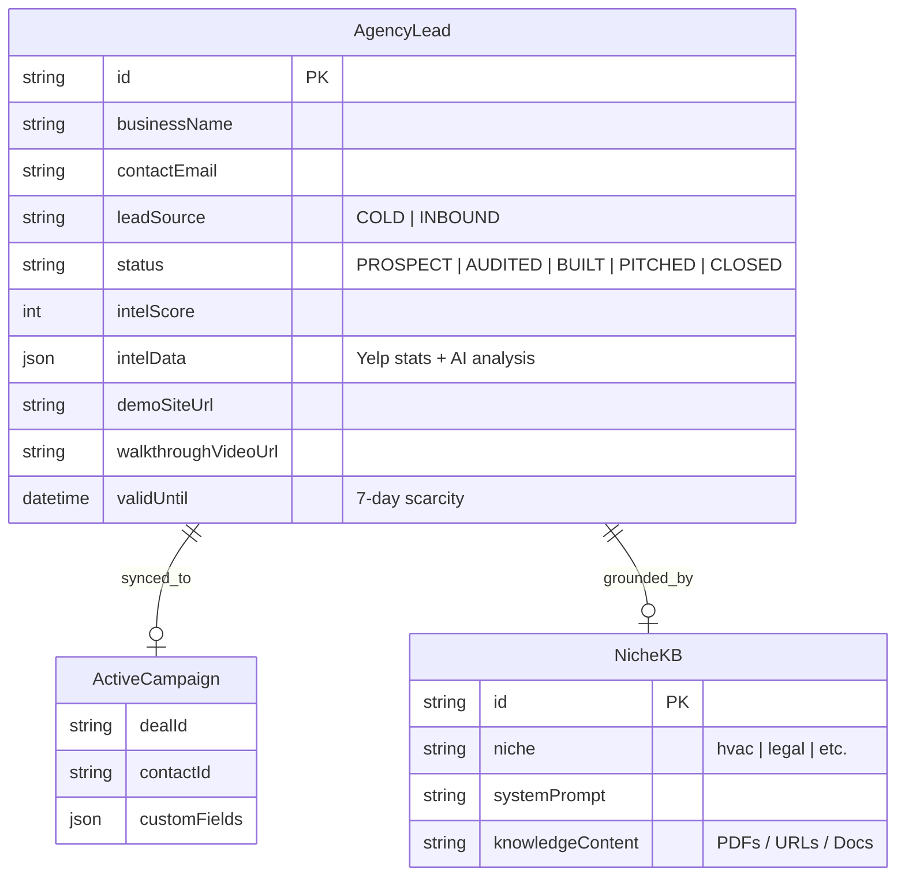

# FlyNerd AI Agency: Project Knowledge Base

This document serves as the master blueprint for your AI-first agency operations. It defines where code lives, how the database is structured, and how our different "Digital Employee" paths (Cold vs. Inbound) collaborate.

---

## 1. Repository Split (Source of Truth)

| Repository | Purpose | Key Directories/Files |
| :--- | :--- | :--- |
| **`flynerdtech`** | **The Brain (Backend)** | `app/api/agents/`, `app/api/orchestrator/`, `lib/activecampaign.ts`, `prisma/schema.prisma` |
| **`flynerd-agency`** | **The Face (Frontend)** | `app/page.tsx`, `app/pricing/`, `app/demo/`, `public/n8n-niche-workflows/` |

> [!IMPORTANT]
> **Logic Rule**: All heavy AI processing (Intel, Scout, Builder) happens in `flynerdtech`. The `flynerd-agency` site calls these endpoints via server-side fetches or webhooks.

---

## 2. Integrated Architecture (ERD)

---

## 3. The "Two-Path" Collaboration

### Path A: Cold Scouting (Outreach)
1.  **Scout Agent** finds a lead (e.g. "Marietta Plumbing").
2.  **Intel Agent** finds they have 3.2 stars and no website.
3.  **Builder Agent** creates a demo site with a chatbot trained on their business name/service.
4.  **AgencyLead** is created with `leadSource: COLD`.
5.  **Status**: Automated reach-out via ActiveCampaign.

### Path B: Inbound Chat (Fulfillment)
1.  Visitor lands on `flynerd.tech` or a client's site.
2.  **n8n Chat Workflow** engages.
3.  **AgencyLead** is created/updated with `leadSource: INBOUND`.
4.  **Intel Agent** is triggered *instantly* to grade the lead's quality based on their chat responses.
5.  **Status**: Immediate notification to your Slack/Inbox.

---

## 4. Distinguishing Leads in Supabase

To tell the difference between a cold lead and a site visitor, we use the following flags in `AgencyLead`:

1.  **`leadSource`**: New field explicitly marking the origin.
2.  **`placeId`**: Only present for Cold Leads (pulled from Yelp/Google).
3.  **`sessionId`**: Only present for Inbound Leads (tracking their chat session).
4.  **`status`**: Inbound leads often start at `AUDITED` or `QUALIFIED` because they’ve already interacted.

---

## Next Steps
- [ ] Add `leadSource` ENUM to `prisma/schema.prisma`.
- [ ] Update **Intel Agent** to support "Instant Inbound Analysis".
- [ ] Sync **ActiveCampaign** to handle separate tags for `#COLD_LEAD` vs `#INBOUND_VISITOR`.
